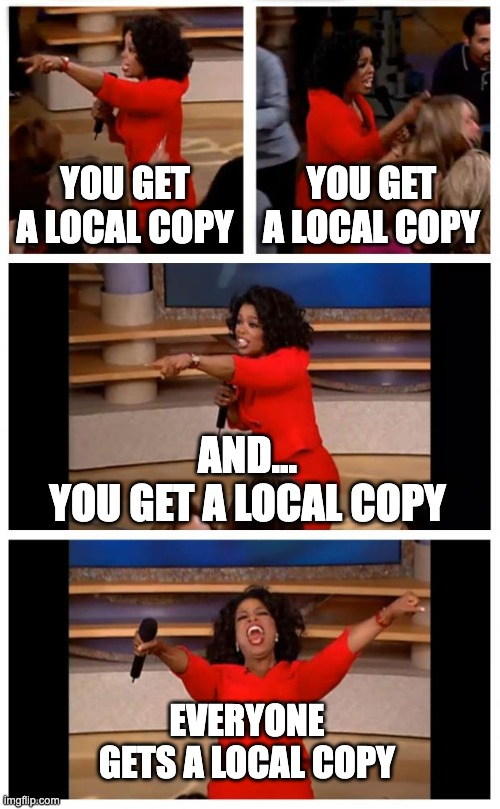
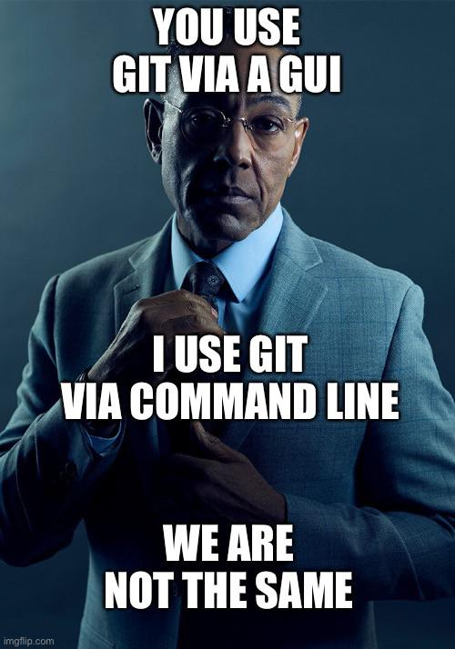
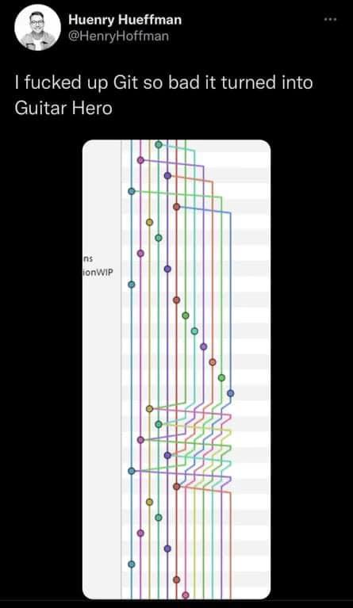

# Bioinformatics exercises from Basic toolkit for bioinformatics research

Aleksandra Janik 08.04.2025 more information can be found on my main page in profile README

## Git what it is and why should I care
Starting with this popular and hackneyed title I would like to present what have I learned about Git on my classes

### 1. Git

It is version control system which helps to keep track on changes, enables user to go back to previous versions and it works really well in larger groups that are working on the same code so they can make branches on which they can work on simultanously without messing with master branch. 
### 2. It is recommended to use command line

Although GUI is very compelling to use, it is simpler and faster to use command line while using git. At first it can be frustrating and can lead to many weird merged files but later it proves to be more convienient to use terminal. 

### 3. Commands
 

+ **git add** - is a basic command that adds copy of file from computer to repository
+ **git commit** - for me it's the most problematic command because it expects commit message to be written and usually I don't want everyone to know that I've messed up the file and I need to replace it manually or use another questionable git practices. 
+ **git push** - it is usually the last command before our file will be send to repository.
+ **git status** - it's a command that shows uncommited changes and if there are some conflicts
+ **git pull** - is used to download changes from repository to local machine
+ **git init** - it creates an empty git repository
+ **git stash** - it puts changes that cause conflicts to temporary stash
+ **git checkout** - it allows to change branch
+ **git merge** - it combines to two branches
+ **git fetch** - it downloads commits and files from remote repository but it doesn't force you to merge with your local repository
+ **git diff** - it shows differences between files
+ **git clone** - it allows to clone remote repository into computer
+ **git config** - shows username that will be used while commiting changes

### 4. Branches

This function is very useful while working on large project it lets us create new branch with some part of the the code without ingering in the main code and when the part is done we can simply merge it with main branch. It is also useful while working in team on the same code so everyone can have separate branch and then can send pull request to merge with main branch. Below is a graphic representation of how branches can look.

